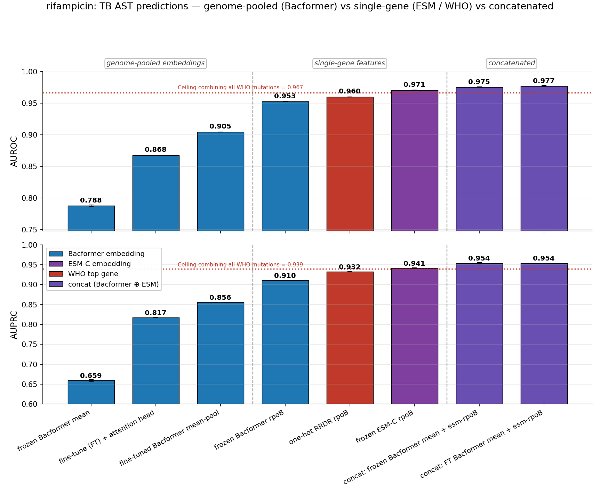
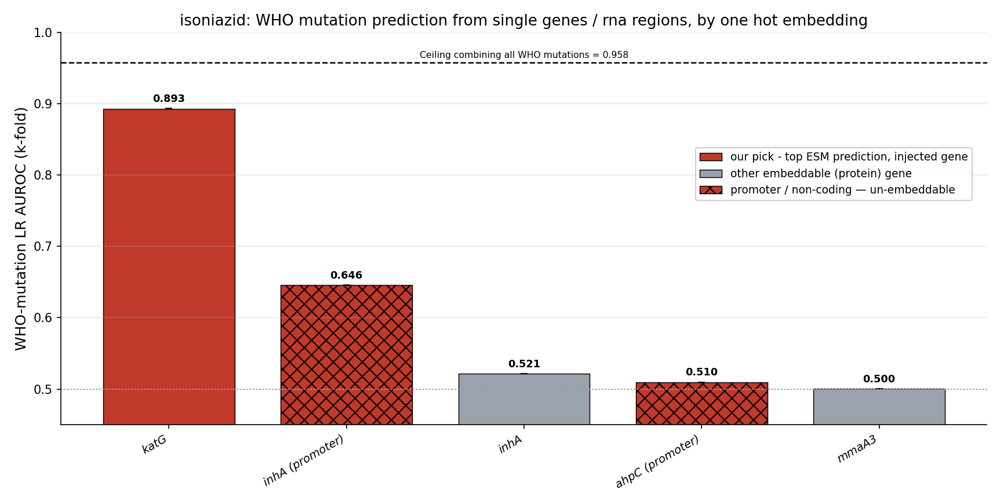
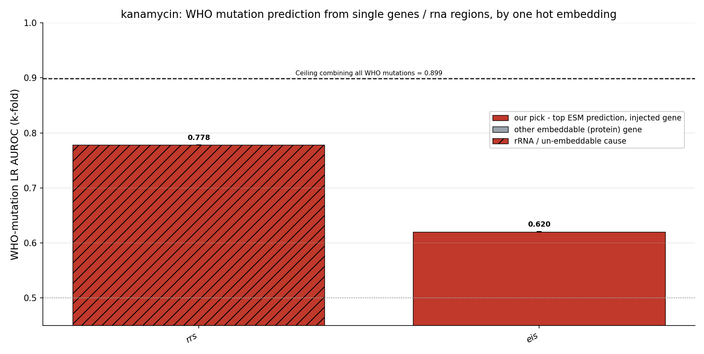

# TB-AST read-out — progress report

*The full arc of Task 7 (`snp_embeddings`): why Bacformer's mean-embedding AMR prediction underperforms in
TB, how we recovered it, how far that gets us against the WHO catalogue, and the one barrier that remains.
The detailed diagnostic phase (the routing experiments, the surprisal sub-studies, every sub-figure) is in
[`docs/PROGRESS_REPORT.md`](docs/PROGRESS_REPORT.md); operational detail is in [`CLAUDE.md`](CLAUDE.md);
the forward plan is `~/.claude/plans/i-d-like-to-start-crystalline-allen.md`. Per-drug figures live under
[`docs/visualisations/tb_<drug>/`](docs/visualisations/).*

## The question

*M. tuberculosis* rifampicin AST underperforms (deployed Bacformer eval AUROC ~0.905, against a
WHO-catalogue ceiling ≥0.96) while *Klebsiella* AST is strong. Programme hypothesis: **Bacformer reads
HGT / gene-acquisition resistance well but is comparatively blind to chromosomal point mutations and
non-coding resistance** — exactly TB's regime, where a single RRDR codon in *rpoB* confers resistance.
This task localises *where* the single-residue signal is lost, recovers it, and then maps precisely which
mechanisms remain out of reach.

---

## 1. Where the signal lives and dies — the rifampicin localization ladder

Bacformer's deployed input is a **chain of two averages**: ESM-C mean-pools ~1,180 *rpoB* residues into one
960-vector, then Bacformer mean-pools ~4,000 protein tokens into one genome vector. A single RRDR
substitution is one residue in ~1,180, then one protein in ~4,000. We placed a linear probe at each stage
of the production pipeline, all scored on the same rifampicin evaluate split (n≈6.9k):

| Pipeline stage | Representation the classifier sees | RIF eval AUROC |
|---|---|---:|
| SNP genotype (the catalogue ceiling) | one-hot RRDR codon | 0.960 |
| **ESM-C protein pool** | frozen mean-pooled *rpoB* 960-vector | **0.971** |
| Bacformer protein token | frozen contextualised *rpoB* token | 0.953 |
| **Bacformer genome pool (the deployed input)** | frozen mask-mean over ~4,000 tokens | **0.788** |
| Deployed model | fine-tuned mean-pool head | 0.905 |
| Learned attention pool (e2e gated-MIL) | gated attention over the ~4,000 tokens | 0.868 |

**The signal survives ESM-C, survives the contextualised token, and collapses only at the genome
mean-pool.** Two conclusions follow:

1. **The first average is innocent.** The frozen pooled ESM-C *rpoB* vector scores **0.971** — *at or above*
   the one-hot ceiling. The residue→protein mean does **not** destroy the signal.
2. **The second average is the culprit.** The frozen *rpoB* token (0.953) collapses to **0.788** once it is
   mean-pooled into ~4,000 other proteins — that one step costs **0.165 AUROC**. And **fine-tuning the
   mean-pool head cannot undo it** (0.905 < the 0.953 it pools away): a learned classifier on top of a
   destructive pool cannot recover what the pool discarded.

---

## 2. The single ESM-C gene vector is an *adequate representation* — the problem is surfacing it

The crucial corollary of (1): **the causal-gene ESM-C embedding is, on its own, a sufficient feature for
the task** (0.971, matching the catalogue). The defect is not in the embedding; it is that the genome
mean-pool **buries** that one vector among ~4,000 proteins before the classifier ever sees it. So the whole
problem reduces to: *how do we surface the causal gene's ESM-C vector to the classification head?* Two
strategies:

- **(A) Replace the pool with a learned attention head** that concentrates on the causal gene.
- **(B) Bypass the pool** and hand the causal-gene vector to the classifier directly (concatenation).

---

## 3. Strategy A — the attention head, and why it (and its augmentations) failed

We built the natural remedy: a **learned gated-attention MIL pool** (one softmaxed weight per protein
token, then a weighted sum), trained freeze-first then end-to-end. **It lost to the mean** (e2e **0.868**,
frozen **~0.78** < the mean-pool's 0.905). Since a uniform set of weights *is* the mean, losing to it means
the head never concentrated on *rpoB*. Three label-blind routing diagnostics (detail in
[`docs/PROGRESS_REPORT.md` §6](docs/PROGRESS_REPORT.md)) explain why:

- The **frozen** model attends *rpoB* in the top ~0.2% — but **R ≈ WT**: it attends the *conserved gene*,
  not the *mutation* (structural hub-ness from masked-genome pretraining, not a resistance signal).
- **Fine-tuning erodes it** — the mean-pool drops *rpoB* out of the top-20 entirely; e2e gated-MIL pushes it
  to ~rank 20.
- **The head's pool never routes to *rpoB*** — it sits at only the ~68th weight-percentile, never #1. On a
  balanced/confounded mini-set the head *can* concentrate sharply, but onto **lineage / accessory-genome
  markers** (the phylogenetic shortcut), still suppressing *rpoB*. From the resistance label alone the head
  cannot find the one SNP-bearing protein among ~4,000.

The fixes we considered all **depend on the attention head** — they feed it an explicit per-protein
*pointer* to the anomalous protein, but are bottlenecked by the same routing failure:

- a **per-protein ESM-C surprisal panel** (the mutated protein flags into the high tail; the cheap unmasked
  proxy is faithful to the masked gold standard, Pearson **0.948**, and the SNP is a razor single-residue
  spike — masked surprisal 8.14 at the site vs 0.50 background, #1 anomaly in 72% of isolates);
- a **per-gene logistic-regression probability channel** (each core gene's own ESM-C LR resistance
  probability, train-only cross-fitted to stay leakage-free).

Both are *pointers into the head*. Useful, built, and recorded — but since the head itself won't route,
they inherit its ceiling. This motivated abandoning Strategy A.

---

## 4. Strategy B — concatenation surfaces ESM directly, and it works

Instead of fixing the pool, **bypass it**: concatenate the causal-gene ESM-C vector to the classifier input
and fit a plain logistic regression. This needs no attention head at all.

- ESM-C *rpoB* alone → LR is already **0.971**.
- **Concatenating it to the Bacformer genome-mean → 0.975 (frozen mean) / 0.977 (fine-tuned mean).** The
  genome-mean adds genome/lineage context *on top of* the gene vector — small but real, confirmed by
  k-fold × m-seed (concat beats ESM-rpoB-alone **15/15** runs; frozen Δ+0.0023, an honest eval-holdout FT
  k-fold Δ+0.0065).

So **Strategy B solves the read-out** — inelegantly (a hand-injected gene vector, not a learned pool), but
decisively: concat tops the ladder, above the fine-tuned mean (0.905), the attention head (0.868), and even
the one-hot RRDR catalogue (0.960). *The read-out, not the embedding, was the bottleneck.*

---

## 5. It generalises, and it mostly catches (or beats) the WHO catalogue

The recipe **"causal gene ⊕ genome mean → LR"** holds across the TB panel (the causal gene auto-discovered
by a per-gene ESM-LR screen — rpoB/rif, katG/inh, embB/emb, pncA/pza, gyrA/fluoroquinolone). The lift scales
with how much headroom the single gene leaves:

| drug (gene) | gene alone | concat | lift |
|---|---:|---:|---:|
| isoniazid (katG) | 0.914 | **0.940** | **+0.026** |
| pyrazinamide (pncA) | 0.916 | **0.928** | +0.011 |
| ethambutol (embB) | 0.933 | **0.939** | +0.006 |
| rifampin (rpoB) | 0.970 | **0.972** | +0.002 |
| moxifloxacin (gyrA) | 0.921 | 0.920 | wash (gyrA already saturates) |

We then benchmarked against the **WHO catalogue itself**: TB-Profiler (WHO v2) over all **36,684 genomes**,
a per-drug one-hot of its catalogued mutations → LR, ceiling = *all WHO mutations combined*. The embedding
concat **mostly recovers close to, or surpasses, the one-hot of all WHO mutations**:

- **Embedding BEATS the catalogue — pyrazinamide: concat 0.928 ≫ WHO one-hot 0.854 (+0.074).** pncA
  resistance is *hundreds of diverse loss-of-function mutations*; the one-hot can only encode catalogued
  ones, but the ESM embedding captures the **functional consequence of any damaging mutation** — it
  generalises to mutations the catalogue has never seen. The single strongest argument for embeddings.
- **Tie — rifampin (0.972 vs 0.967), ethambutol (0.939 vs 0.935), fluoroquinolones** — both capture the
  coding hotspot (rpoB RRDR, embB, gyrA QRDR).
- **Catalogue still wins where the cause is non-coding** — see §6.

---

## 6. The critical remaining gap — promoters and RNA are not in ESM (or Bacformer)

ESM-C embeds **proteins**. Where a drug's resistance is driven by **promoter** mutations or **rRNA**, the
protein sequence is unchanged, so neither ESM-C nor the (protein-only) Bacformer holds *any* information
about it. There the embedding-surfaced concat **stays far below the WHO ceiling** — and whether the genome
context can partially compensate is drug-specific:

- **isoniazid — partially recovered.** 87% of inhA-mediated resistance is a **promoter SNP** (`c.-777C>T`
  etc.; 4,361 non-coding vs 641 coding genomes) that leaves the inhA *protein* WT — so the inhA ESM vector
  is structurally blind (inhA-protein LR **0.526 = chance**) while the mutation one-hot sees it (0.650). Yet
  the concat reaches 0.940 vs the 0.958 ceiling (gap only 0.018): isoniazid resistance is dominated by
  *katG* (a coding change ESM reads at 0.904) plus a strong lineage/co-resistance background the
  Bacformer mean carries, so Bacformer+ESM largely closes the inhA gap **indirectly**.
- **kanamycin / streptomycin — not recovered.** Here the dominant cause is **rrs (16S rRNA)**, with no
  protein to embed and no strongly-correlated protein proxy. kanamycin's WHO ceiling 0.899 towers over every
  embedding method (~0.833); the best the ESM screen can offer is a weak co-resistance proxy. The gap is the
  un-embeddable rRNA, and Bacformer+ESM cannot recover it.

The per-drug **WHO one-hot histograms** make this explicit: every WHO site is split into **coding
(embeddable, solid)** vs **promoter / non-coding** vs **rRNA** (distinct hatches), against the combined
ceiling — a literal map of the protein-embedding blind spot.

---

## 7. Takeaway and forward

- **Barrier 1 — the mean does not surface a single ESM embedding — is solved**, if inelegantly: the
  attention head won't route to the causal gene, but **concatenation** hands it to the classifier directly,
  and concat ⊕ Bacformer mean recovers close to or beyond the full WHO catalogue for the coding-driven drugs.
- **Barrier 2 — the next biggest — is the lack of promoter and rRNA encodings.** Promoter SNPs (inhA) and
  rRNA variants (rrs/rrl) are invisible to a protein-only model; the embedding stays below the WHO ceiling
  exactly there, and only sometimes recovers via correlated genome context (isoniazid yes, kanamycin no).
  This is precisely what **Bacformer 2** (nucleotide / genome-aware) is built to encode — the per-drug
  gap-map already marks the targets and the recoverable headroom.
- **Next: *Klebsiella*.** Before pursuing further prediction-method improvements, we compare and contrast in
  a **different substrate** — Kp AMR is mostly **HGT-driven** (Bacformer's strong regime), with a handful of
  weak, chromosomal/efflux/regulatory drugs (**colistin 0.807, azithromycin 0.827**, …) that mirror TB. Using
  **Kleborate** (CARD-derived, already run) as the determinant ceiling, we run the same screen / concat /
  ladder / gap-map across all 22 Kp drugs, weakest first. See the plan file.
