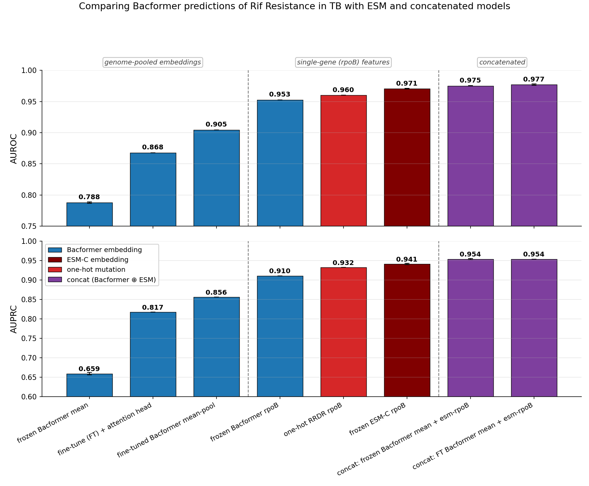

# TB-AST read-out — progress report

*Shareable write-up of Task 7 (`snp_embeddings`). Operational detail (paths, models, file map) is in
[`CLAUDE.md`](CLAUDE.md); the living plan is `~/.claude/plans/i-d-like-to-start-crystalline-allen.md`.*

## The question

*M. tuberculosis* rifampicin AST underperforms (deployed Bacformer eval AUROC ~0.905) while *Klebsiella*
AST is strong. Programme hypothesis: **Bacformer reads HGT / gene-acquisition resistance well but is
comparatively blind to chromosomal point mutations** — TB's regime (the rpoB/RRDR SNP). This task finds
*where* the single-residue signal is lost and what fixes it.

## The logical run — what we found

1. **The signal is present in the protein-level embeddings, and destroyed by pooling.** Frozen ESM-C
   rpoB scores **0.97** and the frozen Bacformer contextualised rpoB token **0.95**; the protein→genome
   **mean-pool collapses it to 0.79**. Fine-tuning the mean-pool recovers it only to **0.905**.
2. **A learned attention pool does not rescue it.** On the honest full data the gated-MIL head never
   concentrates — it collapses to a ~uniform mean (effective ≈ all ~4,000 proteins; rpoB at its 1/n
   share) and scores **0.868**, *below* the plain mean-pool. On a balanced/confounded mini-set the same
   head *does* concentrate sharply (onto ~4 genes) — so it **can** concentrate — but it routes onto
   **lineage / accessory-genome markers** (where embedding differences are largest), still suppressing
   rpoB. The head works mechanically; the training label alone can't steer it to the causal gene — it
   takes the phylogenetic shortcut.
3. **So inject the causal-gene vector directly.** Concatenate the ESM-C rpoB vector to the Bacformer
   genome-mean and fit a plain logistic regression: **AUROC 0.975** on the full eval — above the
   fine-tuned mean-pool (0.905), the attention head (0.868), and one-hot RRDR mutation alone (0.960).
   The ablations reproduce the ladder exactly (esm-rpoB 0.9705 vs 0.971; frozen mean 0.7880 vs 0.788),
   so the harness is sound. **The read-out, not the embedding, was the bottleneck.**
4. The 0.975 used the **untuned (frozen)** Bacformer mean ⊕ frozen ESM — fine-tuned mean ⊕ ESM is the
   natural next test, and the template ("causal gene ⊕ genome mean") should generalise to more genes/drugs.

## The ladder (rifampin, full eval, n≈6.9k)

Full table with AUPRC/sens/spec + sources: [`docs/rif_ladder_table.md`](docs/rif_ladder_table.md).
Concat (purple, 0.975) > frozen ESM-C rpoB (maroon, 0.971) > one-hot mutation (red, 0.960) > fine-tuned
Bacformer (blue, 0.905) > attention head (0.868) > frozen mean (0.788). **The top-end deltas are small
and not yet significance-tested — k-fold × seeds is needed to claim concat genuinely beats one-hot.**

## Forward plan (concatenation + LR; generalise off Prokka)

- **Scale concatenation across TB.** Fine-tuned mean ⊕ ESM; top-1/top-3 causal-gene concat; then the
  **top-10 TB antibiotics**, each benchmarked (with k-fold × seeds) against a **TB-Profiler one-hot
  baseline** — can a Bacformer+ESM concat reliably beat the rule-based caller?
- **Finish the attention-head story.** Panel-inject a per-gene LR signal into the gated-MIL head and see
  whether the supervised panel finally routes the gate to rpoB on the honest eval.
- **Generalise away from Prokka.** Cluster Bacformer's contextualised protein embeddings into gene
  families ("Panaroo on steroids", scalable to 35k TB genomes), assess them against Panaroo + ANI, and
  use families (not Prokka calls) as the LR / Pyseer basis.

Details + experiment matrix: the plan file above.
