# Why TB-AST prediction with Bacformer underperforms, and how to fix it

## The question

*M. tuberculosis* rifampicin AST underperforms (deployed Bacformer eval AUROC ~0.905, against a
WHO-catalogue ceiling ≥0.96) while *Klebsiella* AST is strong. Programme hypothesis: **Bacformer reads
HGT / gene-acquisition resistance well but is comparatively blind to chromosomal point mutations and
non-coding resistance** — exactly TB's regime, where a single RRDR codon in *rpoB* confers resistance.
This task localises *where* the single-residue signal is lost, recovers it, and then maps precisely which
mechanisms remain out of reach.

The contrast is the whole motivation. Across *Klebsiella*'s 22-drug AMR panel Bacformer is strong almost
everywhere — most drugs AUROC > 0.95 — and the floor sits at **colistin 0.807** and **azithromycin 0.827**
(both chromosomal / efflux). TB rifampicin's deployed ~0.905 — *below a one-hot of a single SNP codon* — is
the anomaly we explain.

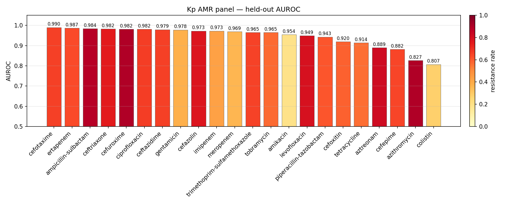

*Klebsiella AMR is mostly HGT-driven — Bacformer's strong regime — and it predicts the whole panel well
(from the `kleb_ast` eval). The few weak Kp drugs (colistin, azithromycin, cefepime, aztreonam) are
chromosomal / efflux / regulatory: the same regime as TB, and the planned Kp counterpart to everything
below.*

---

## 1. Where the signal lives and dies — the rifampicin localization ladder

Bacformer's deployed input is a **chain of two averages**: ESM-C mean-pools ~1,180 *rpoB* residues into one
960-vector, then Bacformer mean-pools ~4,000 protein tokens into one genome vector. A single RRDR
substitution is one residue in ~1,180, then one protein in ~4,000. We placed a linear probe at each stage
of the production pipeline, all scored on the same rifampicin evaluate split (n≈6.9k):

| Pipeline stage | Representation the classifier sees | RIF eval AUROC |
|---|---|---:|
| SNP genotype (the catalogue ceiling) | one-hot RRDR codon | 0.960 |
| **ESM-C protein pool** | frozen mean-pooled *rpoB* 960-vector | **0.971** |
| Bacformer protein token | frozen contextualised *rpoB* token | 0.953 |
| **Bacformer genome pool (the deployed input)** | frozen mask-mean over ~4,000 tokens | **0.788** |
| Deployed model | fine-tuned mean-pool head | 0.905 |
| Learned attention pool (e2e gated-MIL) | gated attention over the ~4,000 tokens | 0.868 |

**The signal survives ESM-C, survives the contextualised token, and collapses only at the genome
mean-pool.** Two conclusions follow:

1. **The first average is innocent.** The frozen pooled ESM-C *rpoB* vector scores **0.971** — *at or above*
   the one-hot ceiling. The residue→protein mean does **not** destroy the signal.
2. **The second average is the culprit.** The frozen *rpoB* token (0.953) collapses to **0.788** once it is
   mean-pooled into ~4,000 other proteins — that one step costs **0.165 AUROC**. And **fine-tuning the
   mean-pool head cannot undo it** (0.905 < the 0.953 it pools away): a learned classifier on top of a
   destructive pool cannot recover what the pool discarded.

---

## 2. The single ESM-C gene vector is an *adequate representation* — the problem is surfacing it

The crucial corollary of (1): **the causal-gene ESM-C embedding is, on its own, a sufficient feature for
the task** (0.971, matching the catalogue). The defect is not in the embedding; it is that the genome
mean-pool **buries** that one vector among ~4,000 proteins before the classifier ever sees it. A per-gene
ESM-LR *screen* makes the point directly — across every gene in the genome, *rpoB*'s own ESM-C vector is by
far the strongest single predictor of rifampicin resistance:

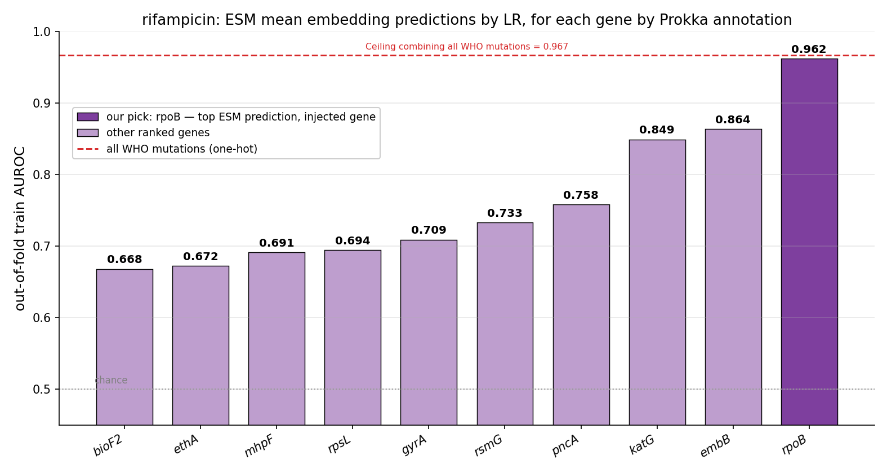

So the whole problem reduces to: *how do we surface the causal gene's ESM-C vector to the classification
head?* Two strategies:

- **(A) Replace the pool with a learned attention head** that concentrates on the causal gene.
- **(B) Bypass the pool** and hand the causal-gene vector to the classifier directly (concatenation).

---

## 3. Strategy A — the attention head, and why it (and its augmentations) failed

We built the natural remedy: a **learned gated-attention MIL pool** (one softmaxed weight per protein
token, then a weighted sum), trained freeze-first then end-to-end. **It lost to the mean** (e2e **0.868**,
frozen **~0.78** < the mean-pool's 0.905). Since a uniform set of weights *is* the mean, losing to it means
the head never concentrated on *rpoB*. Three label-blind routing diagnostics (detail in
[`docs/PROGRESS_REPORT.md` §6](docs/PROGRESS_REPORT.md)) explain why:

- The **frozen** model attends *rpoB* in the top ~0.2% — but **R ≈ WT**: it attends the *conserved gene*,
  not the *mutation* (structural hub-ness from masked-genome pretraining, not a resistance signal).
- **Fine-tuning erodes it** — the mean-pool drops *rpoB* out of the top-20 entirely; e2e gated-MIL pushes it
  to ~rank 20.
- **The head's pool never routes to *rpoB*** — it sits at only the ~68th weight-percentile, never #1. On a
  balanced/confounded mini-set the head *can* concentrate sharply, but onto **lineage / accessory-genome
  markers** (the phylogenetic shortcut), still suppressing *rpoB*. From the resistance label alone the head
  cannot find the one SNP-bearing protein among ~4,000.

Augmentations that hand the head an explicit per-protein *pointer* to the anomalous protein — a surprisal
panel, a per-gene logistic-regression channel — were prototyped, but they **depend on the same head** that
won't route, so they inherit its ceiling. Attention-pool read-outs are a weak, difficult literature and a
rabbit hole; we deprioritised Strategy A (the methods, with their numbers and the rationale, are in the
[Appendix](#8-appendix)) in favour of the simpler path that already works.

---

## 4. Strategy B — concatenation surfaces ESM directly, and it works

Instead of fixing the pool, **bypass it**: concatenate the causal-gene ESM-C vector to the classifier input
and fit a plain logistic regression. This needs no attention head at all.

- ESM-C *rpoB* alone → LR is already **0.971**.
- **Concatenating it to the Bacformer genome-mean → 0.975 (frozen mean) / 0.977 (fine-tuned mean).** The
  genome-mean adds genome/lineage context *on top of* the gene vector — small but real, confirmed by
  k-fold × m-seed (concat beats ESM-rpoB-alone **15/15** runs; frozen Δ+0.0023, an honest eval-holdout FT
  k-fold Δ+0.0065).

So **Strategy B solves the read-out** — inelegantly (a hand-injected gene vector, not a learned pool), but
decisively: concat tops the ladder, above the fine-tuned mean (0.905), the attention head (0.868), and even
the one-hot RRDR catalogue (0.960). *The read-out, not the embedding, was the bottleneck.*

Why rifampicin is the *easy* case is worth seeing once, here. The WHO catalogue's own per-site view of
rifampicin resistance is a single **coding** hotspot — *rpoB* (the RRDR), fully embeddable, with no promoter
or rRNA contribution — which is exactly why an ESM-surfaced concat can *tie the entire catalogue*. The drugs
in §5–§6 get harder precisely where this picture stops being all-coding.

---

## 5. The complete TB picture — concat ties the WHO catalogue, and for pyrazinamide beats it

Using a combination of ESM embedding (surfaced) plus mean finetuned bacformer embedding helps a lot of TB drug prediction.  It gets our predictions equal or better the an WHO in 6/9 drugs studied. The recipe **"causal gene ⊕ genome mean → LR"** (causal gene auto-discovered by the per-gene ESM-LR screen)
holds across the whole TB panel. Scoring every drug's concat against the **WHO catalogue ceiling** —
TB-Profiler (WHO v2) over all **36,684 genomes**, a one-hot of *all* that drug's catalogued mutations → LR —
sorts the nine drugs into three clean regimes:

| regime | drug (ESM gene) | ESM gene | concat | WHO ceiling | concat − WHO |
|---|---|---:|---:|---:|---:|
| **beats WHO** | pyrazinamide (pncA) | 0.916 | **0.928** | 0.854 | **+0.074** |
| ties WHO | rifampicin (rpoB) | 0.970 | 0.972 | 0.967 | +0.005 |
| ties WHO | ethambutol (embB) | 0.933 | 0.939 | 0.935 | +0.004 |
| ties WHO | levofloxacin (gyrA) | 0.916 | 0.916 | 0.916 | 0.000 |
| ties WHO | moxifloxacin (gyrA) | 0.921 | 0.920 | 0.926 | −0.006 |
| ties WHO | isoniazid (katG) | 0.914 | 0.940 | 0.958 | −0.018 |
| **below WHO (§6)** | streptomycin (rpsL/rrs) | 0.841 | 0.863 | 0.908 | −0.045 |
| **below WHO (§6)** | kanamycin (rrs) | 0.799 | 0.832 | 0.899 | −0.067 |
| **below WHO (§6)** | ethionamide (inhA/ethA) | 0.743 | 0.772 | 0.871 | −0.098 |

**1 — Five drugs *tie* the catalogue.** rifampicin, ethambutol, levofloxacin, moxifloxacin, isoniazid: concat
lands within ~0.02 of the WHO ceiling — the embedding *replicates* catalogue-grade prediction from sequence
alone, with no curated mutation list. In each the single ESM gene carries most of the height and the frozen
Bacformer genome-mean augments it into the top bar. The two **ladders** below (isoniazid, pyrazinamide) show
this directly — the purple ESM gene, then the concat bar level with or past the dotted WHO ceiling:

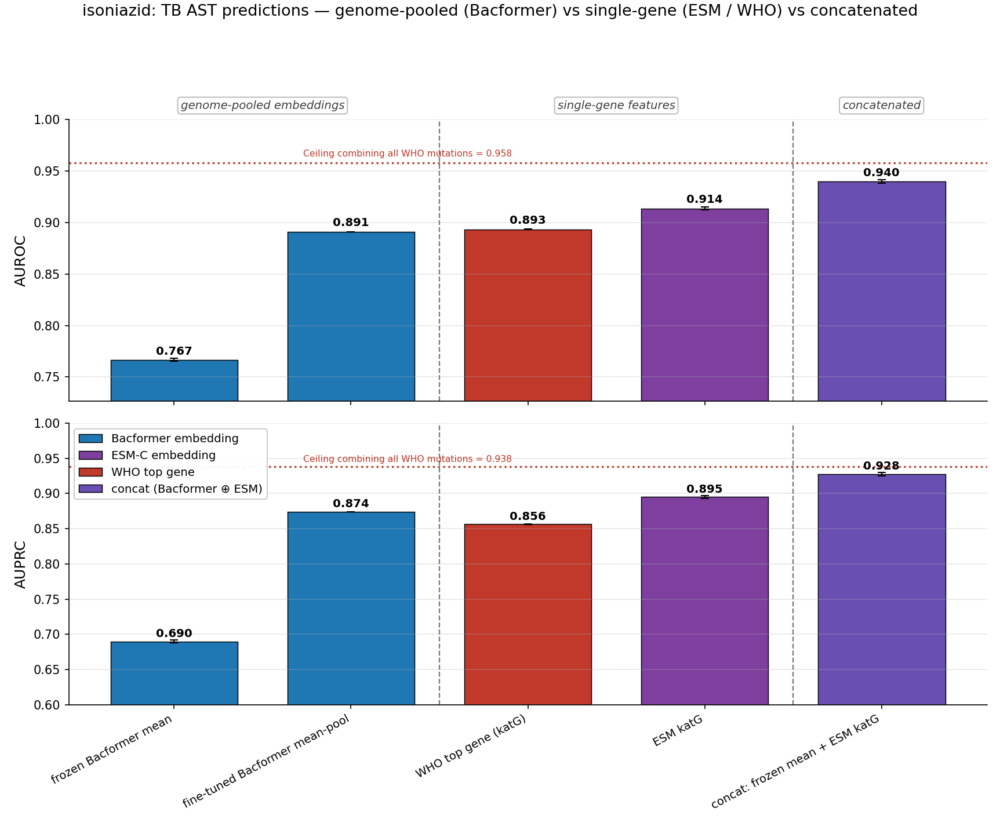
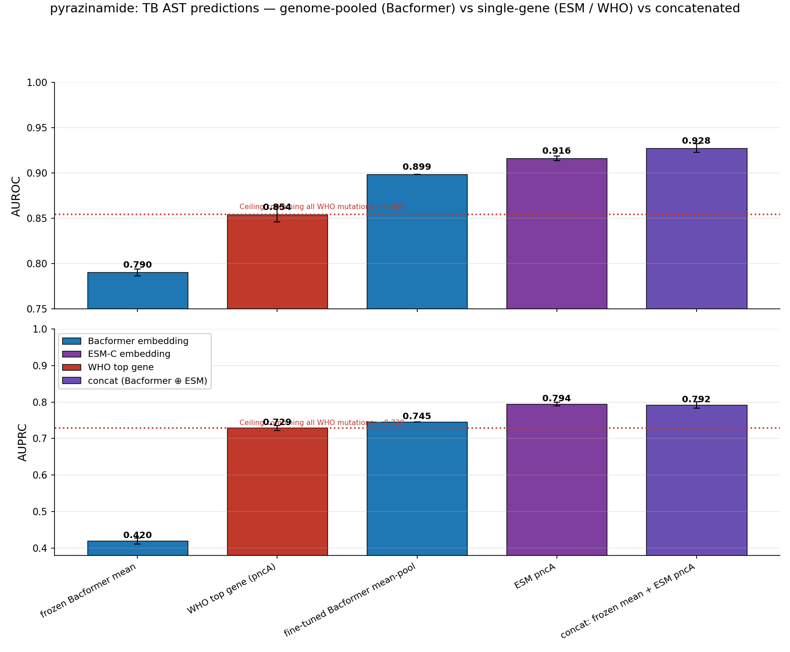

**2 — Pyrazinamide *beats* the catalogue — the encouraging result.** concat **0.928 ≫ WHO one-hot 0.854
(+0.074)**. pncA resistance is *hundreds of diverse loss-of-function mutations*; the one-hot can only encode
the catalogued ones, but the ESM embedding reads the **functional consequence of any damaging mutation**,
generalising to variants the catalogue has never seen. This is the signal that matters for the programme:
the embedding is not merely *reproducing* the WHO catalogue — where the mechanism is a protein it can
**exceed** it. As Bacformer improves, we may not just *replicate* catalogue-based AST but **broadly improve
on it**.

**3 — Three drugs fall *below* the ceiling** — streptomycin, kanamycin, ethionamide — all where the dominant
cause is non-coding (rRNA or promoter / LoF), the protein-embedding blind spot. That is §6.

---

## 6. The critical remaining gap — promoters and RNA are not in ESM (or Bacformer)

ESM-C embeds **proteins**. Where a drug's resistance is driven by **promoter** mutations or **rRNA**, the
protein sequence is unchanged, so neither ESM-C nor the (protein-only) Bacformer holds *any* information
about it. In each per-drug **WHO one-hot histogram** below, every WHO site is split into **coding
(embeddable, solid)** vs **promoter / non-coding** (hatched `xx`) vs **rRNA** (hatched `//`), against the
combined ceiling — a literal map of where the protein-embedding blind spot bites. How far the genome context
can compensate is drug-specific.

**ethionamide — the same promoter, *without* the rescue (the widest gap).** ethionamide is the control for
isoniazid: its dominant cause is the **identical inhA promoter SNP** (WHO one-hot **0.826**, 1,893 genomes)
plus **ethA loss-of-function** (0.608) — non-coding or truncating, both invisible to a protein model. But
ethionamide has **no katG-equivalent coding co-driver**, so the ESM screen surfaces only co-resistance
proxies (*rpoB* 0.744) and concat reaches just **0.772 — a full 0.098 below the ceiling (0.871)**, the widest
gap in the panel. The contrast with isoniazid is the cleanest statement of the thesis: *the same promoter
mechanism is recovered when a coding co-driver (katG) carries it, and lost when none exists.*

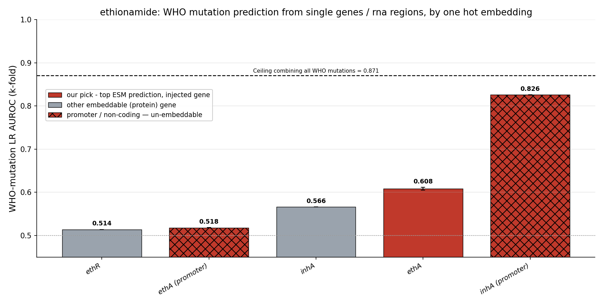
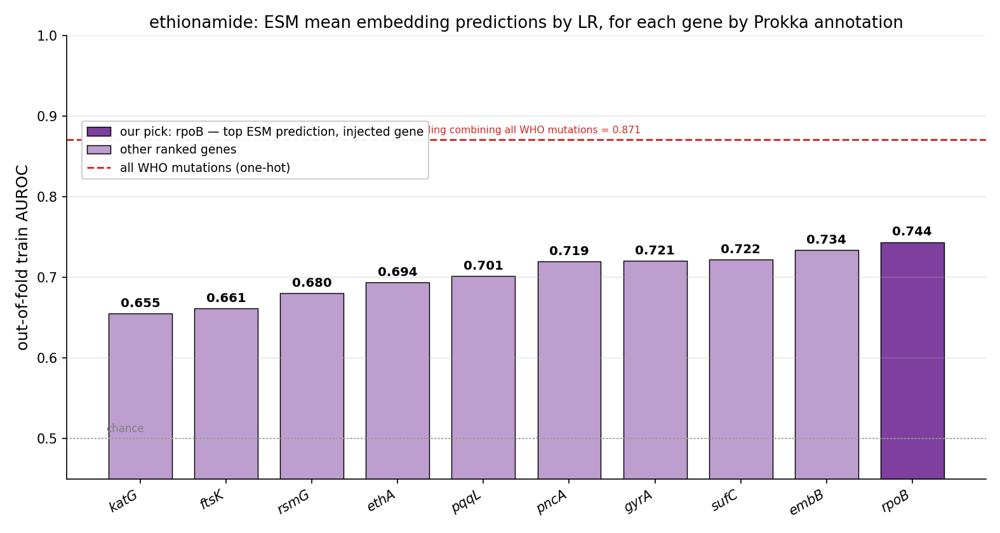
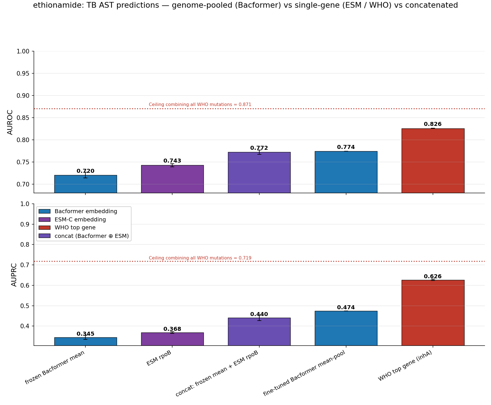

**kanamycin — not recovered.** The dominant cause is **rrs (16S rRNA, 0.778)** plus the **eis promoter
(0.620)** — both un-embeddable, and there is *no* embeddable causal gene at all. So the auto-discovered ESM
"gene" is only a weak co-resistance proxy (*rpoB*, 0.799), and concat (**0.832**) adds essentially nothing
over the fine-tuned mean (0.833): both sit a full **0.067 below the WHO ceiling (0.899)**. This is the clean
un-embeddable case — the whole gap is rRNA + promoter, and the ESM screen has nothing causal to surface:

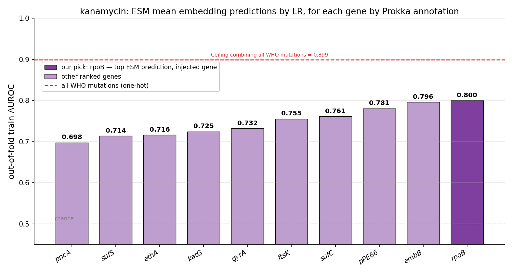
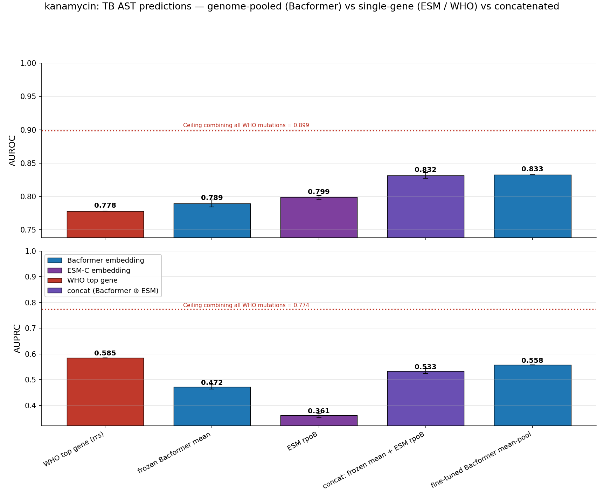

**streptomycin — partly closed, then capped by the rRNA.** Unlike kanamycin, streptomycin *does* have an
embeddable coding cause — **rpsL** (ribosomal protein S12; WHO one-hot 0.775) — alongside the un-embeddable
**rrs (0.586)** and *gid*. So the embedding has something real to grip: concat (**0.863**) clears the
fine-tuned mean (0.834) by ~0.03. But the auto-pick still grabs a co-resistance proxy (*katG*, ESM 0.841)
rather than rpsL, and the rRNA fraction stays out of reach — so it lands **0.045 below the ceiling (0.908)**,
closer than kanamycin precisely because part of its mechanism is a protein:

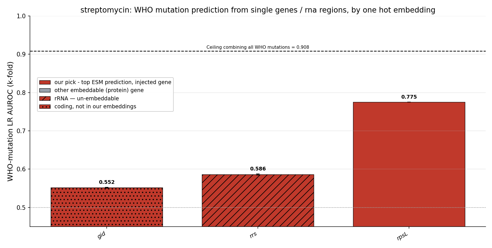
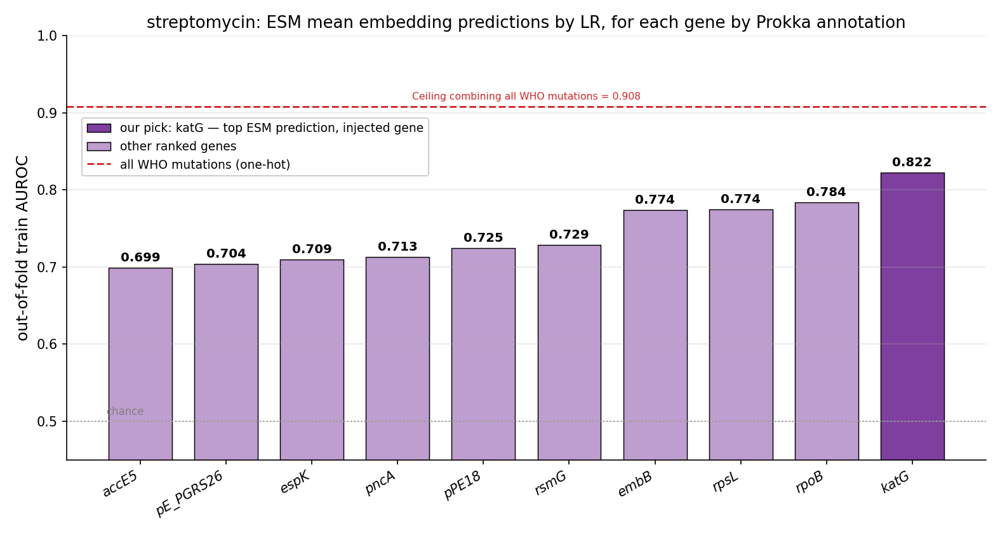
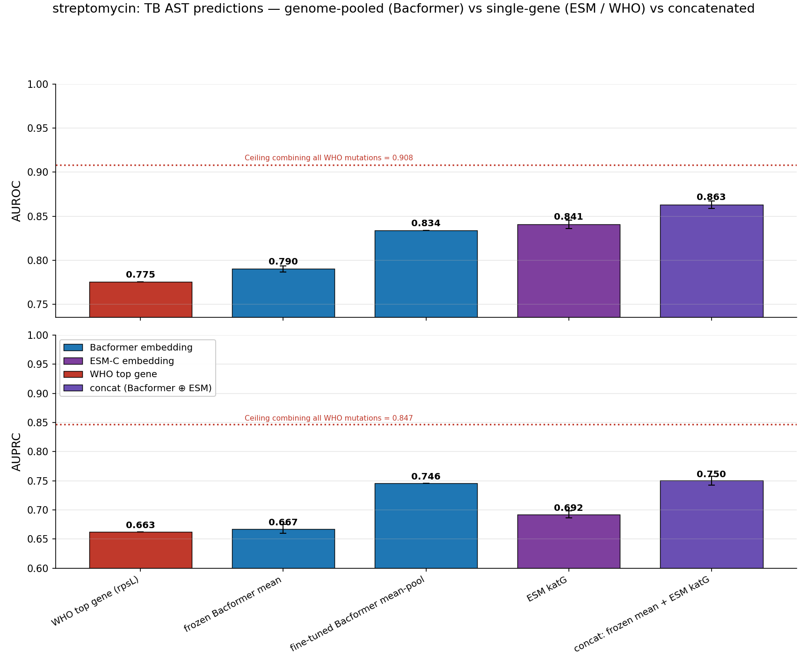

**isoniazid — partially recovered.** 87% of inhA-mediated resistance is a **promoter SNP** (`c.-777C>T` etc.;
4,361 non-coding vs 641 coding genomes) that leaves the inhA *protein* WT — so the inhA ESM vector is
structurally blind (inhA-protein LR **0.526 = chance**) while the mutation one-hot sees it (0.646). Yet the
concat reaches 0.940 vs the 0.958 ceiling (gap only 0.018): isoniazid resistance is dominated by *katG* (a
coding change ESM reads at 0.914) plus a strong lineage / co-resistance background the Bacformer mean
carries, so Bacformer+ESM largely closes the inhA gap **indirectly** (its ladder is in §5; here the inhA
promoter is the hatched stub beside the dominant *katG* coding bar):

---

## 7. Takeaway and forward

- **Barrier 1 — the mean does not surface a single ESM embedding — is solved**, if inelegantly: the
  attention head won't route to the causal gene, but **concatenation** hands it to the classifier directly.
  Across the panel concat ⊕ Bacformer mean **ties the full WHO catalogue on five coding-driven drugs**
  (rifampicin, ethambutol, levofloxacin, moxifloxacin, isoniazid) and **beats it on pyrazinamide (+0.074)**.
  That last point is the one to carry forward: the embedding is not merely replicating the catalogue — where
  resistance is a protein it can **exceed** it, so an improving Bacformer may broadly *surpass* catalogue-based
  AST, not just reproduce it.
- **Barrier 2 — the next biggest — is the lack of promoter and rRNA encodings.** Where the dominant cause is
  non-coding — rRNA (*rrs*: kanamycin, streptomycin) or a promoter / loss-of-function (*inhA* + *ethA*:
  ethionamide) — the protein-only embedding stays below the WHO ceiling (−0.045 to −0.098), recovering only
  when a coding co-driver happens to carry it (isoniazid's *katG* yes; ethionamide, the same promoter without
  *katG*, no). This is precisely what **Bacformer 2** (nucleotide / genome-aware) is built to encode — the
  per-drug gap-map already marks the targets and the recoverable headroom.
- **Next: *Klebsiella*.** Before pursuing further prediction-method improvements, we compare and contrast in
  a **different substrate** — Kp AMR is mostly **HGT-driven** (Bacformer's strong regime), with a handful of
  weak, chromosomal/efflux/regulatory drugs (**colistin 0.807, azithromycin 0.827**, …) that mirror TB. Using
  **Kleborate** (CARD-derived, already run) as the determinant ceiling, we run the same screen / concat /
  ladder / gap-map across all 22 Kp drugs, weakest first. See the plan file.

----

## 8. Appendix

*The full arc of Task 7 (`snp_embeddings`): why Bacformer's mean-embedding AMR prediction underperforms in
TB, how we recovered it, how far that gets us against the WHO catalogue, and the one barrier that remains.
The detailed diagnostic phase (the routing experiments, the surprisal sub-studies, every sub-figure) is in
[`docs/PROGRESS_REPORT.md`](docs/PROGRESS_REPORT.md); operational detail is in [`CLAUDE.md`](CLAUDE.md);
the forward plan is `~/.claude/plans/i-d-like-to-start-crystalline-allen.md`. Per-drug figures live under
[`docs/visualisations/tb_<drug>/`](docs/visualisations/).*

### Possible methods to append to an attention head

If the read-out *were* a learned attention pool (Strategy A, §3), it would need an explicit per-protein
pointer to the anomalous protein. Two were prototyped:

- **Surprisal panel** — a per-protein ESM-C surprisal (−log P) vector handed to the gate. The mutated
  *rpoB* flags into the high tail; the cheap unmasked single-forward proxy is faithful to the expensive
  masked gold standard (Pearson **0.948**), and the resistance residue is a razor single-residue spike
  (masked surprisal 8.14 at the site vs 0.50 background; the #1 anomaly in 72% of isolates).
- **Per-gene logistic-regression channel** — each core gene's *own* ESM-C LR resistance probability, keyed
  by Prokka/Bakta annotation (or, later, by Bacformer protein-family clusters), fed to the head as a
  supervised pointer; train-only cross-fitted to stay leakage-free.

The limitation of all these is that they depend on the attention head, and the literature around attention
heads is weak — it is a difficult area and a rabbit hole to pursue. We have thus **deprioritised it in
favour of exploring other large contributing factors** *while* surfacing a single embedding seems to work
very well in many cases. This can be reviewed.

### Figure placeholders (to add)

- the HGT-vs-chromosomal mechanism stratification, once Kleborate / WHO mechanism labels are wired in;
- the *Klebsiella* screen / ladder / gap-map set, as the Kp counterpart to §§4–6 above.

